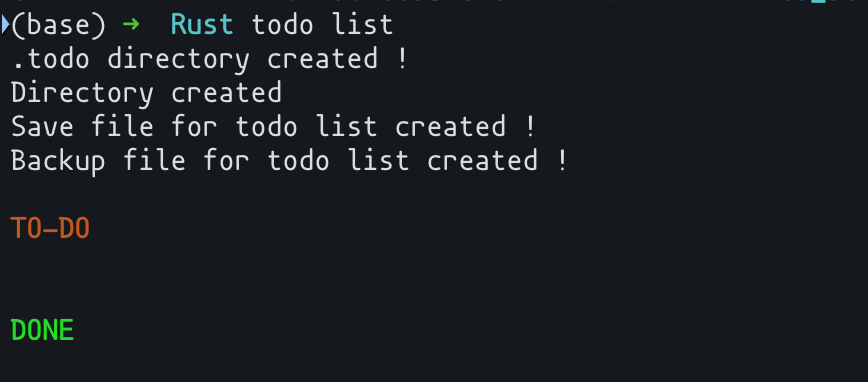
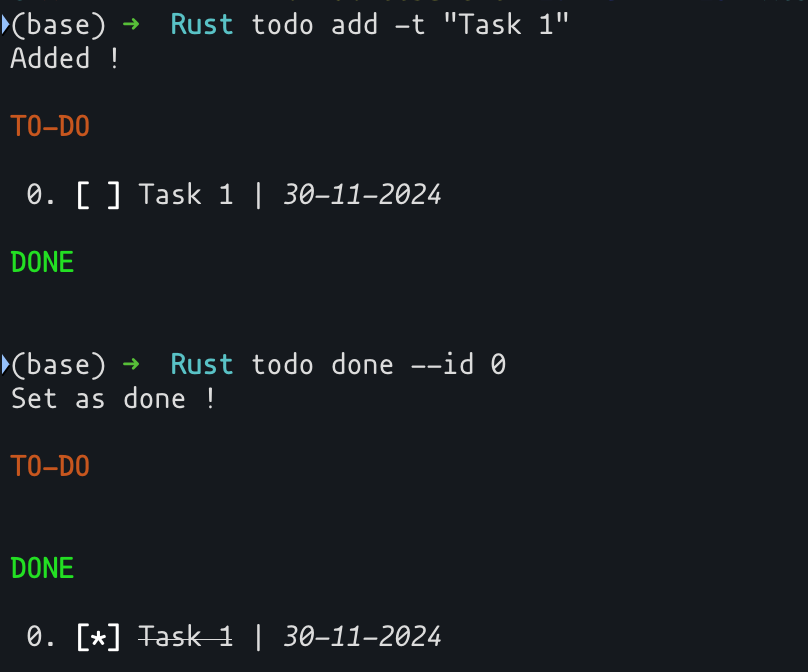
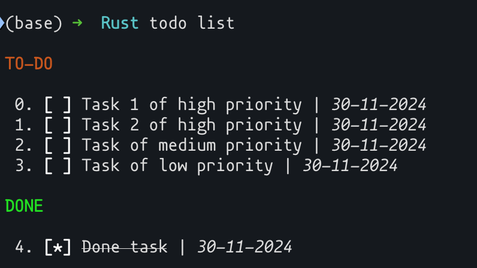
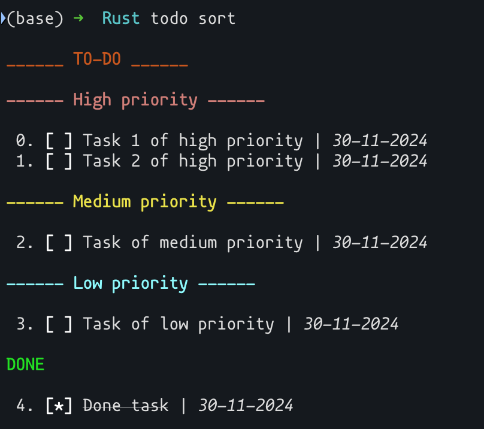

# The project

This is a small personnal project to learn to use `Rust`. 

## Usage : 

You need to build the binaries using `cargo build` and to put it in your binaries. 
Each time you run a the `todo` command in a directory, a `.todo` directory will be created if it doesn't already exists. 

The commands are the following ones : 
-  `add`     :  To add a task to the todo list
-  `done`    :  To set a task as done in the to-do list
-  `remove`  :  To remove a task from the todo list
-  `restore` :  To undo the last changes of the to-do list.
-  `reset`   :  Clear the todo list.
-  `sort`    :  Display the todo list sorted by priority.
-  `list`    :  Display the to-do list sorted by dates.

___ 
## Examples : 

- ***Adding a new task*** : 

- ***Displaying the todo list*** :

with the regular way

___

